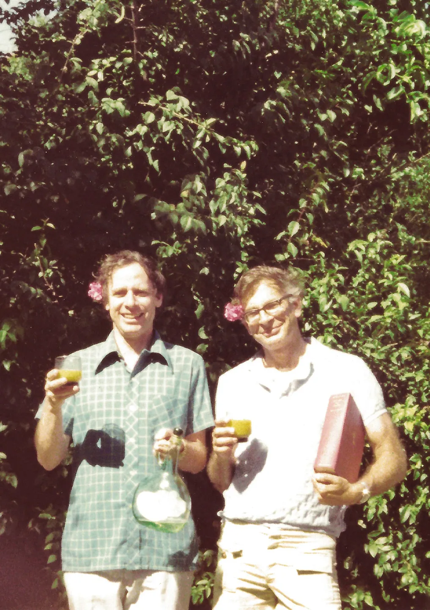

# The Assignment {#cross}

## Meet Kahneman & Tversky

Amos Tversky (left: 1937-1996) and Daniel Kahneman (right: 1934-) transformed the field of behavioural economics in the 70s and 80s. Collaborating on groundbreaking research, they challenged traditional economic theories of "rational behaviour" by revealing the systematic biases and cognitive errors characteristic of human decision-making. The work of these two will be the focus of your research.

::: fyi
Daniel Kahneman was awarded the [Nobel Peace](https://www.nobelprize.org/prizes/economic-sciences/2002/kahneman/facts/) Prize in 2002 for his and Amos' groundbreaking work in human decision-making.
:::

```{r, echo=FALSE, out.width="50%", fig.align="center"}

```

## Stage 1: Literature Review {#Part1}

**The evolution of a hypothesis**

Your first job is to:

1.  Find **one** of K&T's original research papers with Google Scholar or the [Laurentian Omni library](https://omni.laurentian.ca/discovery/search?vid=01OCUL_LU:OMNI&lang=en "Laurentian Library") with a theory/hypothesis that you can follow from K&T's original paper through subsequent papers until today. **Your aim is to find at least 9 studies that build on and test that theory.**

::: fyi
Do not choose an obscure theory that only 2 people have heard about. You won't garner extra marks for this. For the purposes of this exercise the theory or hypothesis you choose should be **well tested**.
:::

So, your first study will be a Kahneman and Tversky study, next, a study that sits on the shoulders of that study, then another that progressed from that study, and so on until you find a study conducted between 2020 and today. A *minimum* of 10 articles should be cited. As Dr. Emond says, "Kind of like six degrees of separation but with citations".

These will make up your intro and discussion references in the final write up. The point of this exercise is to get familiar with how a theory and the questions that arise from it, change and evolve over time--not just with new evidence but with fresh perspectives of the different researchers that test them.

```{r, echo=FALSE, out.width="100%", fig.align="center"}
#knitr::include_graphics("images/kevinback.jfif")
```

## Stage 2: Study Design {#Part2}

Once you have chosen *one* of T&K's theories, you will design an **experiment** to test it.

**Next steps:**

1.  Informed by your research in Stage 1 and the experiment you would like to conduct, write a short intro/literature review, explaining the question you are exploring and referencing the articles you identified in you Stage 1. This write up will eventually be placed in the intro section of the R document you create.

**Some points your intro should include:**

a.  Where did K&T's original hypothesis/theory come from (what previous theories informed it?)
b.  How did K&T test the hypothesis/theory originally and how has the methodology been refined/evolved over time?
c.  What were the findings? Were they expected or unexpected?
d.  How did the results inform new questions?
e.  **How will *you* test the theory in a hypothetical experiment?**

Remember, you're not writing a thesis, so don't go too crazy here (see word count recommendations in the sidebar for expected counts).

2.  Be sure to state your purpose, hypothesis and any other questions you would like to answer *clearly* and with justification.
3.  Make sure to *operationally define* your independent variable(s) and dependent variable(s). Keep in mind you should choose a research design that demonstrates your understanding of the concepts learned in class. A factorial design will blow our socks off.
4.  Describe your design, procedure and planned statistical analysis (e.g. ANOVA, t-tests, MANOVA, etc.) clearly in the Methods section.
5.  Do not forget to explain how you will control for any confounding variables.

::: fyi
For all of the parts above, **complete** descriptions must be given. In **full detail**. Also, you must **justify** all of your choices. Why you decided to design it the way you did and define your variables the way you did.
:::

There are a couple of ways you can tackle this step:

1.  **Do your write up in Word first**, then copy and paste it into R when you're ready.

2.  **Do what I do, write directly in R**.

HOWEVER, because R can be intimidating and confusing at first and I don't want you losing hours of work with a mistake, it might be smart to have a copy of your write up in Word or Google Docs, just in case! Once you get the knack of R you'll never have to use Word as back up again. But for now, it might give you peace of mind and its very easy to copy and paste your write up directly into R. It's what I did in the beginning and it worked like a charm.

```{r, echo=FALSE, out.width="50%", fig.align="center"}
knitr::include_graphics("images/smart-brain.gif")
```

## Stage 3: R Analysis & Writeup

Now that you have your design nailed down, you will email the design (including the expected range/levels of your outcome variable) to Shauna (the TA). You can send this in a word document or copy and paste the design into an email. Within a couple of days she will send you some "fake" data that corresponds to your design and chosen outcome. You will use this data for your "analysis" in R. 

::: lightbulb
Be sure to submit your design and outcome requirements for your data to Shauna at least ONE MONTH before the final due date so you have time to troubleshoot any problems as well as analyze & write up your results and discussion.
:::

While you are waiting for your data, if you haven't already, its time to install R.

**Steps you will complete in R:**

1. Email your design with enough detail about your dependent variable, controls and independent variable(s) that Shauna can create a dataset for you that matches your outcome and experimental groups.

3. Install R and R Studio and customize your workspace (see R Tutorials) while you are waiting for your data.

::: fyi
You do not have to wait until this step to install R. In fact I would install it near the beginning just so you have it ready to go when its time for this step.
:::

2.  Once you have your dataset, you will start your data analyses. You'll find a video tutorial to follow (see Analysis Tutorial that will be uploaded by February 10th) where l will walk you through how to visualize your data, conduct your analysis (ANOVA, correlations or anything else your heart desires), and finally save it all as a publication ready pdf.

3.  You will plot at least one data visualization that conveys your main results.

4.  Write a BRIEF summary of your "findings" (mini-results) in your Results section.

5.  Copy and paste your entire write-up into your R document. Remember, there needs to be an Introduction, Methods, Results and a short Discussion/Conclusion.

6.  Finally, write a very brief conclusion that wraps it all up, including at least two things you learned (or didn't learn) during this assignment!

7.  Knit your pdf from R and hand it in via Dropbox on D2l (this step will be included in the video tutorial).

::: lightbulb
If you have trouble with any part of this assignment, email me at sheron\@laurentian.ca to set up a zoom or in person meeting. I'm here to help!
:::

## Assignment Checklist

Make sure your final document includes:

1.  **A brief introduction** to the topic, explaining the theory you are exploring and referencing the article(s) it is grounded in (see Stage 1) with a **clearly** stated **purpose** and **hypothesis**.
2.  A **Methods** section that describes your **sample population**, **design and procedure** and includes clear **operational definitions for your independent, control and dependent variable(s)**.

::: lightbulb
Do not forget to explain how you will control for any **confounding variables**
:::

3.  A BRIEF summary of your "findings"\* in the **Results section**, including:

    -   a **visualization** of your outcome variable distribution (e.g. histogram).

    -   The descriptive statistics of your sample population (e.g. number of participants in each group, average scores in each group etc).

    -   At least one **visualization that conveys your main results** (e.g. your treatment effect).
    
6.  A *brief* **discussion** connecting your results to past research and the direction that future research could take.
7.  **A one paragraph conclusion** that wraps it all up. including at least two sentences that share what you learned or didn't learn during this assignment.
8.  A cover page and **reference page** at the end (APA formatted).
9.  Hand in everything to D2l as a knitted pdf (see tutorial).

::: fyi
Click this [link](output/SampleAPAPaper.pdf) to see the R APA manuscript template you will be filling out. What you are looking at is the pdf rendered output of the R document. 
:::

## Word Count & Formatting 

Your final document should be APA formatted with citations and a reference page. I don't mind if you keep your visualizations inline (rather than at the back), as it makes for an easier comparison of visualizations with the results. The template you will be using to create your R document is already APA formatted, so this step should be easy for you.

Your intro and discussion should contain no more than 2000 words combined--as per the max word count of most modern publications. Similarly, your methods and results should contain no more than 2000 words combined [(APS, 2023)](https://www.psychologicalscience.org/publications/psychological_science/ps-submissions)--though 1000-1500 should be more than enough for our purposes. You won't need as much space for results as your analysis will be simpler than the average real paper.

I would say your Intro, Methods, Results and Discussion (not counting the cover page and references) should be approximately 8-12 double-spaced pages. You will *not* be penalized for going over that; at the same time, overwriting won't win you extra marks, either. Keep it clear and concise!
