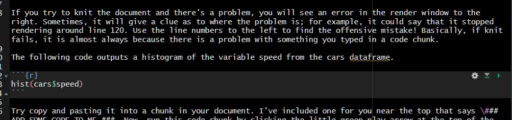

# R Tutorials {#Intro}

## Installing R and R Studio

Head to this link and choose the installation for R and R Studio that corresponds with your operating system (Windows or MacOS)

[R and R Studio](https://posit.co/download/rstudio-desktop/)

You will first click "Install R".

[{width="698"}](https://cran.rstudio.com/)

From the next page, you will choose one of the top links–either R for Windows or R for macOS, depending on your laptop.

[{width="419"}](https://cran.rstudio.com/)

Download the file, then install using the default settings if possible. If you run into problems there is plenty of help to be found on the R website and there is a great video below that can help too. You can also email Shauna for help ([sheron\@laurentian](mailto:sheron@laurentian){.email}) if you run into trouble.

**Once R is installed, click the link above again, and this time go to step 2: Install R Studio.** Click the link circled below for a Windows install,

[](https://posit.co/download/rstudio-desktop/)

For a Mac install scroll down a little on the same page and you'll see the Mac OS 12+ install:

[](https://posit.co/download/rstudio-desktop/)

## Opening R Studio

1.  Open **R Studio** for the first time by clicking on it's icon.

{width="218"}

NOTE: you will almost *never* open R itself, but always R Studio.

Once it loads, R Studio you will see the workspace is divided into 4 “panes” or work areas.

-   The **Source** for your scripts and documents (top-left, in the default layout)

-   Your **Environment/History** (top-right) which shows all the objects in your working space (Environment) and your command history (History)

-   Your **Files/Plots/Packages/Help/Viewer** (bottom-right)

-   The R **Console** (bottom-left)


The placement of these panes and their content can be customized (see menu, Tools -\> Global Options -\> Pane Layout). For ease of use, settings such as background color, font color, font size, and zoom level can also be adjusted in this menu (Global Options -\> Appearance).

## Customizing R Studio

This screenshot below illustrates how I have R Studio configured. To get your self set up the same, follow the [Video Tutorial](https://www.youtube.com/watch?v=jAHJyeOqe24) created by the amazing Psychology researcher and statistics prof Andy Field. I highly recommend ALL of his stats videos as well as his textbooks–especially the ones relating to R. Here, he will walk you through customizing your workspace.

In my own R Studio, I chose the "modern" R studio theme (Tools –\> Global Options –\> Appearance) and have been using Andy's layout for years now.


## Create your project

At the top left of your screen, click the File dropdown and select "New Project". By default, R projects are usually stored in your documents folder. Here, you'll click on **New Directory**.


Next, click New Project and you'll be prompted to select a location for your project. I find it best to leave the project subdirectory as C:/documents (or wherever your docs directory is). Then select a name for your new project. E.g. ResearchMethods_Assignment. This is where your project, your data and all of your files will live.


In future, you should open Rstudio and your project from that folder where you'll see an icon that looks like a 3-d cube.


This opens your project workspace. A workspace is your current working environment in R which includes any user-defined object. By default, all of these objects will be saved, and automatically loaded, when you reopen your project.

Next, it is good practice to create several subfolders for the data you will analyze. Click on the "Files" tab in the right pane (depending on where you located it). Here you should see the root folder of your project. From here, click "New Folder" and name in "Raw Data" and then create another called "Processed Data" and now you're set. All files related to your project will be in this workspace.

### Install Packages

::: lightbulb
R is case sensitive and does not like variable or object names with spaces. E.g. the name Red Group would have to be RedGroup or Red_Group or `Red Group` or R will throw your errors.
:::

In the console window of R, copy and paste this code into the command line then hit return:

```{r, eval=FALSE}
install.packages(c("tidyverse", "dplyr", "psych", "patchwork", "sjPlot", "lme4", "papaja", "lme4"))
```


You'll see a bunch of code flashing by while the packages install. Hopefully it goes smoothly :) Sometimes you will have to restart R after an install, but an easy way to do this is to click on the "Session" drop-down above and then select "Restart R." This will restart the program without actually leaving the workspace.

To install an individual package, you would type:

```{r, eval=FALSE}

install.packages("thenameofthepackagehere")

```

or you can search for the package in the Cran package directory found in the packages tab


When the installations have finished, you can load the packages into the workspace by pasting the following code in the console:

```{r, eval=FALSE}
library(dplyr)
library(tidyverse)
library(lme4)
library(psych)
library(patchwork)
library(sjPlot)
library(papaja)

```

but we'll get back to packages when creating your first project.

## Create your R Markdown Document

Next you will create your R Markdown document from the papaja template. With your project open, click File --\> New File --\> Markdown Document.

{width="533"}

On the left you're going to select "From Template" and then "APA-style manucript (6th edition)"


Now you should see an untitled document in the main pane of Rstudio. Click on the little disk icon at top left to save this file and give it a name while you're at it. It will automatically save the file to the root of your project folder.

## R Markdown basics

::: fyi
The tutorial below is not fully fleshed out but will be by mid-February (I will send out an email when it's live). Until then, work on steps 1 to 2 of your assignment and make sure you have R and R Studio installed. Also, watch Nick Fox's tutorial below. The rest of what I've left below is for those who would like to start playing with R right away.
:::

Let's get acquainted with the anatomy of an R Markdown document. There are three main components of the document: the YAML header, the formatted text (where you put your writeup) and code chunks (this is where executable code goes). Before proceeding, watch Nick Fox's [Markdown tutorial](https://www.youtube.com/watch?v=lQaW020f57M) to get an idea of where we're going. I will be adding a video tutorial here soon also (mid-February). I'm just leaving this here for those already curious :)


Before you change anything in the document, let's see how this file looks without any editing. Hit the "Knit" button at the top of R Studio (little ball of yarn), and wait. A bunch of code will flash by in the Render window. If it works, it will get through all the code without an error.

You should now find a pdf file in the root of your project that looks like this: [link](output/SampleAPAPaper.pdf). Just click on the file pane to the right, and a pdf will load. Click on it to open it. As you can see, it produces an APA-formatted PDF of the document you have open now. Your next steps will be to replace the pre-written text with your own.

Let's modify the document step by step:

### The YAML

Here you will add your title, your name and any other information. One caveat–the YAML area is VERY sensitive. Indents must be kept as is and any text changes MUST be contained within quotes. So, in the above example, you would replace the title Variance Heterogeneity title with your own. Ensuring that you have the title enclosed in the " ". Replace the author's name with your name. Add a subtitle and/or anything else you'd like. If you want to check your changes in the pdf, click the knit button then open the file from the root of your folder again.

### Formatted Text Area

### Code chunks

You'll notice in the document there are areas with plain text and small code chunks. The plain text will render as... well, plain text. If you look at the pdf created, you'll see it prints Times New Roman, 12 pt font according to APA guidelines. The codechunks are the lighter grey areas that start with the three italics followed by an R inside curly brackets.



Any text in a code chunk MUST be code. You can not have random text in here, as everything within it will be "executed" as a command. You can't have plain text in any chunk UNLESS it has a hashtag in front of it which basically tells R to ignore it. Another important thing to keep in mind is R IS CASE-SENSITIVE. So, if you are copying my code or any code, **you must copy the exact text, including the case**. If something is called "df" you **must** call it with df, not Df or DF as R won't find it and will throw you an error.

```{r}
# Here is an example, let's take the iris dataframe and call it df
# Copy this code to a chunk in your R Markdown document
# To create a new chunk, place your cursor in a text area and then hit CTRL-ALT-I

df <- iris

# let's look at the top few rows

head(df)


```

```{r, eval=FALSE}

# try running this code next

plot(Df$Sepal.Width) # an example of R's case sensitivity

```

Oops! You should have got an error from R. Now correct the case error and try again:

```{r}
# A plain histogram
hist(df$Sepal.Width) 

```

```{r, warning=FALSE, message=FALSE}
# Now a prettier one using the ggpubr package
# if you haven't installed it copy and paste install.package("ggpubr") in the console and hit enter

library(ggpubr) 
gghistogram(
  df, x = "Sepal.Width", 
  add = "mean", rug = TRUE,
  fill = "Species", palette = c("#00AFBB", "#E7B800", "#E7B6a6")
  )

```

If you try to knit the document and there's a problem, you will see an error in the render window to the right. Sometimes, it will give a clue as to where the problem is; for example, it could say that it stopped rendering around line 120. Use the line numbers to the left to find the offensive mistake! Basically, if knit fails, it is almost always because there is a problem with something you typed in a code chunk.

The following code outputs a histogram of the variable speed from the cars dataframe.

```{r}
# Notice I placed a hashtag here so that R will ignore this text
# Try copy pasting this code into a code chunk in your Markdown document.

hist(cars$speed)


```

If it worked, you should see a little histogram below the chunk.

Now try knitting the document (Knit button looks like a ball of yarn at top of the frame), and once rendered you should find the histogram in the pdf.

## Learning More

The material we will cover in this short assignment will only give you a taste of what R is capable of. For advanced operations you will need to learn more.

The best way to become more proficient with R, like any tool, is to actively use it. I learned R from the internet out of frustration with the limitations of SPSS. Though there was lots of trial and error and mistakes at first, over time I got better and better, and had to look up code less and less.


At first it may feel daunting, but you will quickly see that there are amazing resources online. FOr example, maybe you want make your wide dataset long for some multilevel analyses–how do you do this in R? Well, a simple "how to make wide dataset long in R" will conjur up thousands of useful links where you can simply copy and paste their code and then just adjust it to use with your specific data. "How do I run an ANOVA in R?" or "ANOVA tutorial in R" will find you:

<https://statsandr.com/blog/anova-in-r/>

The great thing about these kinds of tutorials is that they include the code and often the rationalization as to why they are conducting the analyses like they are with recommendations of what steps should come first as well as how you would test any assumptions. You will learn SOOO much not just about R, but about data this way.

R Markdown

R Markdown Cheatsheet.

<https://www.rstudio.com/wp-content/uploads/2015/02/rmarkdown-cheatsheet.pdf>
