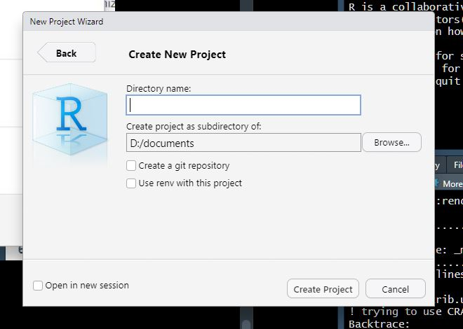
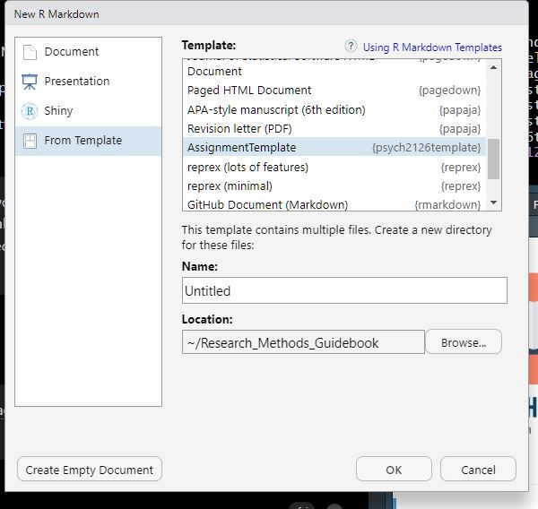

# R Tutorials {#Intro}

## Getting Started

First things first: why R? The reason we want to learn R, is that it allows us to great reproducible resarch

To get started, we will follow along with [Andy Field's](https://www.statisticsadventure.com/) brilliant tutorials which will walk us through:

1.  Installing R and RStudio

2.  Customizing your workspace

3.  Workflow in R Studio

4.  Loading packages and creating your first project

5.  Creating an R Markdown document

6.  R Markdown basics

::: lightbulb
If you run into problems, don't hesitate to reach out to me sheron\@laurentian.ca for help. I can always meet you in person or via zoom to get you sorted. There is also **loads** of online help available that's usually only a Google away.
:::

### Installing R & R Studio

To Install R and R Studio we will follow along with [Andy's "Installing R and R Studio"](https://milton-the-cat.rocks/learnr/r/r_getting_started/#section-installing-r-and-rstudio) tutorial.

::: fyi
The R interface can be a bit intimidating at first, stick with it though as it does become easier over time, and you'll feel like a total wizard in the future when you start to know your way around.
:::

### Customizing your workspace

Next we will follow a [Quick Tour of R Studio](https://milton-the-cat.rocks/learnr/r/r_getting_started/#section-a-quick-tour-of-r-studio) to get to know our way around and customize the workspace. I have my workspace set up the same way and find it the best way.

::: puzzle
To open *R Studio* for the first time, click on the Windows icon and search for it or on a Mac search for *R Studio* in the application search bar (top right).
:::

### Create your project

Next, we will follow along with the [Working in RStudio tutorial](https://milton-the-cat.rocks/learnr/r/r_getting_started/#section-working-in-rstudio). Don't get too bogged down in his explanation of workflow and folder structure; however, you **will** create an R Studio project file for your assignment. Follow along and create your own project–**this will be the folder for your assignment.**

1.  At 8:24 in the video, you will follow along to create your project. Your project folder will be on your computer (rather than on OneDrive as he does in the video). The best place for this is off your **documents** folder. Your new project window will look something like the image below. The Directory name is whatever you'd like to call your project. Ignore the tick boxes but do go ahead and click "Open in new session".

{width="586"}

2.  From inside your new project, **create a data folder from the file pane** (follow along with Andy). No need to create an r.docs folder like he does.

3.  **Create an R Markdown file (12:56 in the video)**

4.  Follow along with the rest of the tutorial to get to know R Markdown.

::: puzzle
Don't worry if everything is as clear as mud, we'll learn more about RMarkdown soon.
:::

5.  **Move to the next step: installing packages.**

{width="763"}

### Install Packages

Next, we will follow along with the [Install Packages tutorial](https://milton-the-cat.rocks/learnr/r/r_getting_started/#section-installing-and-loading-packages).

-   Install the packages he recommends.

<!-- -->

-   Install the following packages as well by copy and pasting the code below to your **console** and hitting return.

```{r, eval=FALSE}
    
install.packages("rmarkdown","papaja", "psych", "DataExplorer", "ggplot2", "sjPlot", "dlookr", "apaTables", "gt")

```

-   We will also install the tutorial package that I created for you, which will include an **assignment template**. It will make things easier to create an APA-formatted document in R Markdown.

Copy and paste the following code into your console and hit enter:

```{r, eval=FALSE}

remotes::install_github("shaunaheron2/psych2126template")

```

-   Once packages are installed, click "Session" then Restart R" (in the top menu of R Studio) to refresh your workspace.

Load the packages we just installed by adding them to the library chunk of your R Markdown document. Hint: copy and paste the code below. You can also load them by adding the code to your console window.

```{r}

library(tidyverse) # powerful data wrangling tool
library(here)
library(dlookr) # powerful data exploration tool
library(papaja)
library(base)
library(psych)
library(DataExplorer) # used to explore data
library(ggplot2) # powerful plotting app
library(sjPlot) # this is for plotting 
library(psych2126template) # this is our template
library(apaTables)
```

## R Markdown

::: fyi
Be sure that you've already installed Papaja and have it loaded in your environment before working along with the tutorial.
:::

In this step Andy will walk you through the basics of R Markdown. Be sure you completed the previous steps under **Getting Started**.

1.  **Follow along with Andy's [tutorial](https://milton-the-cat.rocks/learnr/r/r_getting_started/#section-r-markdown) to get to know the basics.**

| Now you will create an APA formatted document that contains your text write up, your data analysis and your references. You will use this document to create your reproducible scientific paper.

3.  Follow along with [this video](https://www.youtube.com/watch?v=mplP1cjIv-E&list=PLmvNihjFsoM5hpQdqoI7onL4oXDSQ0ym8&index=5) for a step-by-step walkthrough. Note: you won't select the Papaja template as he does, instead select the **AssignmentTemplate** you installed and loaded above. For whatever reason, if you don't see the AssignmentTemplate, just select the APA-style manuscript instead.

::: puzzle
Nick's workspace looks a bit different because he is using a dark theme for his workspace. To change your theme, remember you go to Tools --\> Global Options --\> Appearance pane.
:::

2.  From your project workspace, you'll click **File** –\> **New R Markdown** and select **"From Template"** then **"AssignmentTemplate".** Make sure you installed the packages above or you won't see the template here. Where it says name, give your document a name–like "My Assignment" or whatever else you'd like to call it then click **OK.**



3.  **Try clicking the Knit button to see how the template renders the R Markdown.**

Once the document has rendered, you'll find a .pdf file in your project folder. If it didn't open automatically, click on it in the file pane. Once it is open, you can make changes to the R Markdown and when you click knit you'll see them in the pdf. Sometimes you have to click refresh in your browser to load the changes.

**You'll notice I added three figures using the iris dataset that comes loaded in R:**

1.  A histogram
2.  A boxplot
3.  Violin plots

Follow along with Nick to learn about Papaja and to customize the template.

::: lightbulb
Nick has a different file structure. He is not working from a project, but *you will be* if you followed Andy's instructions above. This means your workspace already knows where the working directory is--its your project folder (which will be off your documents folder if you put it here like I suggested). Just ignore where he puts his files, but everything else is good to follow :)
:::

```{r, eval=FALSE}

# install.packages("papaja") # remove the hashtag at the beginning of this line and run the code to install papaja if you haven't already (see above)

library(papaja)

```

::: fyi
Nick refers to his console at the bottom of the screen, if you followed Andy's workspace setup it will be on the right side of your screen.
:::

## Analysis Tutorial

If you don't already have your data from Shauna, practice with pre-loaded datasets (iris, cars).

Here are some tutorials that complement this section. Simply copy and paste the code below into a codechunk in your project and then run them. Feel free to play around with the code--its the best way to learn.

### Descriptive Table

The first step in analysing any new dataset is to describe and visualize it.

Luckily there are some handy packages to help us do this. Let's use the iris dataset.

Load the iris dataframe and store it in an object we'll call "df"

```{r}

df <- data.frame(iris) 

```

The describe command from the dlookr packages allows you to see the mean, standard deviation and skewness of your data right away.

```{r}

descriptives <- describe(df)

```

You can see there are 5 variables, 4 sepal measurements and a species variable.

If you'd like to look at your dataframe in a table format, use the view command. This will open a sortable table of your dataframe in another tab. To get back to your R Markdown document click on the tab containing it at the top of your workspace.

```{r, eval=FALSE}

view(df)

```

You can also use the gt command to create a pretty, customizable table in your document.

```{r}
library(gt)

descriptives %>% gt()
```

### Histograms

To see a histogram of all the continuous variables in the dataframe use the plot_histogram function from the DataExplorer package. This is a great way to check your outcome variable for normality. Remember, most statistical tests have a set of assumptions that if violated, make the results of said tests unreliable.

```{r}

plot_histogram(df)

```

The histograms tell us a few things:

-   the Petal length histogram tells us that petal length is NOT a normal distribution. Its bimodal, meaning there are two distributions in one. Some petals are really short and some are medium to long.

-   Lucky for us our outcome variable (sepal length) seems relatively normal.

We could also look at correlations to see if there are underlying relationships we need to consider in our data:

### Correlations

```{r}
plot_correlation(na.omit(df), maxcat = 5L)
```

### T-Tests

```{r}

# To run a t-test, our grouping variable can only have two levels, while Species has 4, so we;re just going to look at the difference between two levels

df2 <- df %>% filter(Species=="setosa"|Species=="versicolor") %>% droplevels()

t.test(Sepal.Length ~ Species, data = df2)

```

```{r}

apa_print(
  t.test(Sepal.Length ~ Species, data = df2)
)

```

### Factorial ANOVA

```{r}

```


### Visualize Results

```{r}


```

# Putting it all together

This will show you how to complete your final document containing your analysis and writeup then how to render it as a pdf.

## Learning More

-   [Papaja Manual](https://frederikaust.com/papaja_man/reporting.html)

The material we will cover in this short assignment will only give you a taste of what R is capable of. For advanced operations, you will need to learn more.

The best way to become more proficient with R, like any tool, is to actively use it. I learned R from the internet out of frustration with the limitations of SPSS. Though there was lots of trial and error and mistakes at first, over time I got better and better, and had to look up code less and less.


At first it may feel daunting, but you will quickly see that there are amazing resources online. FOr example, maybe you want make your wide dataset long for some multilevel analyses–how do you do this in R? Well, a simple "how to make wide dataset long in R" will conjur up thousands of useful links where you can simply copy and paste their code and then just adjust it to use with your specific data. "How do I run an ANOVA in R?" or "ANOVA tutorial in R" will find you:

<https://statsandr.com/blog/anova-in-r/>

The great thing about these kinds of tutorials is that they include the code and often the rationalization as to why they are conducting the analyses like they are with recommendations of what steps should come first as well as how you would test any assumptions. You will learn SOOO much not just about R, but about data this way.

R Markdown

R Markdown Cheatsheet.

<https://www.rstudio.com/wp-content/uploads/2015/02/rmarkdown-cheatsheet.pdf>
