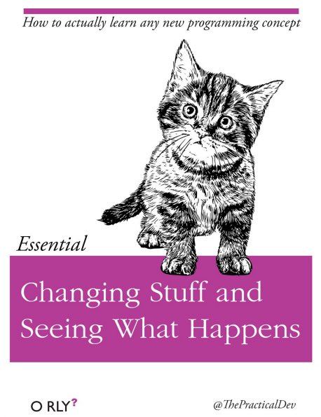

# Getting started with R {#Intro}

## Installing R and R Studio

Head to this link:

[R and R Studio](https://posit.co/download/rstudio-desktop/)

You will first click "Install R".

[{width="698"}](https://cran.rstudio.com/)

From the next page, you will choose one of the top links–either R for Windows or R for macOS, depending on your laptop.

[{width="419"}](https://cran.rstudio.com/)

Download the file, then install using the default settings if possible. If you run into problems there is plenty of help to be found on the R website and there is a great video below that can help too.

Once R is installed, click the link above again, and this time go to step 2: Install R Studio. Click the link circled below for a Windows install,

[](https://posit.co/download/rstudio-desktop/)

For a Mac install scroll down a little on the same page and you'll see the Mac OS 12+ install:

[](https://posit.co/download/rstudio-desktop/)

## Opening R Studio 

1.  Open R Studio by clicking on it it's icon and once you have your first package, you will open via the cube icon in your project folder (see below).

{width="218"}

NOTE: you will almost *never* open R itself, but always R studio.

## Customizing R Studio

RStudio is divided into 4 “panes”. Default colour is white with the following layout:

-   The **Source** for your scripts and documents (top-left, in the default layout)

-   Your **Environment/History** (top-right) which shows all the objects in your working space (Environment) and your command history (History)

-   Your **Files/Plots/Packages/Help/Viewer** (bottom-right)

-   The R **Console** (bottom-left)

The placement of these panes and their content can be customized (see menu, Tools -\> Global Options -\> Pane Layout). For ease of use, settings such as background color, font color, font size, and zoom level can also be adjusted in this menu (Global Options -\> Appearance).

I prefer the "modern" R studio theme (Tools –\> Global Options –\> Appearance). And my console top-right along with terminal and background jobs and Environment, History, Files, Plots, Packages etc. bottom right.


One of the advantages of using RStudio is that all the information you need to write code is available in a single window. There are also shortcuts, autocompletion, and highlighting for the major file types and object you will use in RStudio.

Customize R by checking this [Video Tutorial](https://www.youtube.com/watch?v=jAHJyeOqe24) out by the amazing Psychology researcher and statistics prof Andy Field. I highly recommend ALL of his stats videos as well as his textbooks–especially the ones relating to R. Here, he will walk you through customizing your workspace.

Text [Tutorial](https://support.posit.co/hc/en-us/articles/200549016-Customizing-the-RStudio-IDE "How to customize R Studio")

## Install Packages

On its own, R is great but

In the console window of R, copy and paste this code into the command line then hit return:

```{r, eval=FALSE}
install.packages(c("tidyverse", "dplyr", "psych", "patchwork", "sjPlot", "lme4", "papaja"))
```


You'll see a bunch of code flashing by while the packages install. Hopefully it goes smoothly :) Sometimes you will have to restart R after an install, but an easy way to do this is to click on the "Session" drop-down above and then select "Restart R." This will restart the program without actually leaving the workspace.

To install an individual package, you would type:

```{r, eval=FALSE}

install.packages("thenameofthepackagehere")

```

or you can search for the package in the Cran package directory found in the packages tab


When the installations have finished, you can load the packages into the workspace by pasting the following code in the console:

```{r, eval=FALSE}
library(dplyr)
library(tidyverse)
library(lme4)
library(psych)
library(patchwork)
library(sjPlot)
library(papaja)

```

but we'll get back to packages when creating your first project.

## Creating your project

At the top left of your screen, click the File dropdown and select "New Project". By default, R projects are usually stored in your documents folder. Here, you'll click on **New Directory**.


Next, click New Project and you'll be prompted to select a location for your project. I find it best to leave the project subdirectory as C:/documents (or wherever your docs directory is). Then select a name for your new project. E.g. ResearchMethods_Assignment. This is where your project, your data and all of your files will live.


In future, you should open Rstudio and your project from that folder where you'll see an icon that looks like a 3-d cube.


This opens your project workspace. A workspace is your current working environment in R which includes any user-defined object. By default, all of these objects will be saved, and automatically loaded, when you reopen your project.

Next, it is good practice to create several subfolders for the data you will analyze. Click on the "Files" tab in the right pane (depending on where you located it). Here you should see the root folder of your project. From here, click "New Folder" and name in "Raw Data" and then create another called "Processed Data" and now you're set. All files related to your project will be in this workspace.

## How to learn more?

The material we will cover in this short assignment will only give you a taste of what R is capable of. For advanced operations like cleaning your dataset, running more complex models or creating beautiful visualizations you will need to learn more.

The best way to become more proficient with R, like any tool, is to actively use it to answer your research questions. I learned R from the internet out of frustration with the limitations of SPSS. There was lots of trial and error, but over time I got better and better, and had to look up code less and less.



At first it may feel daunting, but you will quickly see that there are amazing resources online. FOr example, maybe you want make your wide dataset long for some multilevel analyses–how do you do this in R? Well, a simple "how to make wide dataset long in R" will conjur up thousands of useful links where you can simply copy and paste their code and then just adjust it to use with your specific data. "How do I run an ANOVA in R?" or "ANOVA tutorial in R" will find you:

<https://statsandr.com/blog/anova-in-r/>

The great thing about these kinds of tutorials is that they include the code and often the rationalization as to why they are conducting the analyses like they are with recommendations of what steps should come first as well as how you would test any assumptions. You will learn SOOO much not just about R, but about data this way.


 R Markdown

R Markdown Cheatsheet.

<https://www.rstudio.com/wp-content/uploads/2015/02/rmarkdown-cheatsheet.pdf>
