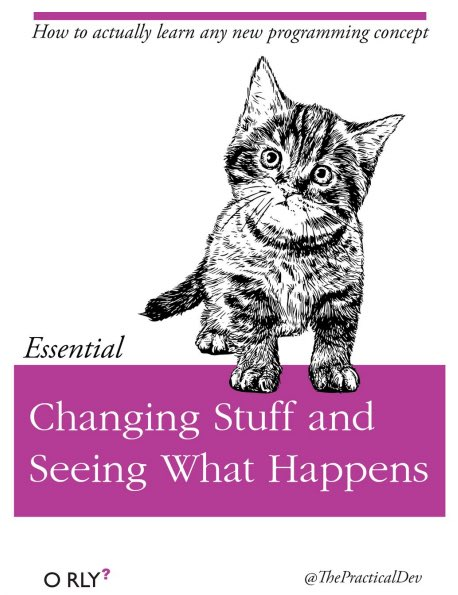

# Lab 1: Putting it all Together

## My template isn't working!

Hi class, some of you may find that the custom template isn't working. Unfortunately, R made some changes that impacted the template, depending on which version of R Studio you have installed. As a result, there could be some issues. That being said, there is a new APA format now which is actually MUCH easier to use. Follow the instructions below step by step to run it.

**If you have trouble with this don't worry because I'll walk you through it on Friday.**

1.  Open R Studio

2.  Create a new Project. Like before you'll choose `New Directory`. Call it Assignment2. Now select `Quarto Project` from the next screen.

3.  Once the project is loaded, in the **Console panel**, type `install.packages("quarto")` .

4.  Now, from the **Console**, open the **`Terminal`** panel (should be top right)

5.  In the terminal panel, copy and paste the following: `quarto use template wjschne/apaquarto` . You may have to hold CTRL-SHIFT-V to paste it or right click and paste because the usual CTR-V doesn't work in terminal. You could even just type it out. Once you paste it in click enter, then Y for the trust check and type APA to create an APA folder for your paper. The APA folder will be inside the Assignment2 folder you just made.

6.  Once installed, click on the file tab (to the right), and you'll see several files and an APA folder. Click to open the APA folder.

7.   Now you're going to download a new template. [DOWNLOAD THIS FILE.](https://github.com/shaunaheron2/PSYCH_2126/blob/fe6f7aa33520f635def9ce4f68a0bc7f9cfe9c16/images/PretendThesis.qmd) The file is called "PretendThesis.qmd". The link will take you to github (it might look scary but its not), just click **ctrl-shift-s** once you load it to download it automatically. You can also click the 3 little dots at the far right and select download. Save it to your downloads folder.

8.  Once downloaded, place the file in the same APA folder you just created. Just use Finder in Windows or Apple OS to do this.

9.  Once it's in the proper place, you'll look on your Files tab in R Studio again and click on it–it's called "PretendThesis.qmd," remember?

10. It should open. **Click Render** (where knit used to be using R Markdown) to see it rendered. We'll go through filling this out in our lab on Friday. Here is the [manual for the template](https://wjschne.github.io/apaquarto/) in case you'd like to see what it's capable of.

```{r, eval=FALSE, include=FALSE}
R and Case Sensitivity

R Markdown and Quarto

https://quarto.org/docs/blog/posts/2023-05-22-quarto-for-academics/

What goes where?

Packages

Loading data

Visualizing data

Analyzing data

Visualizing Your Results

Zotero & Citations

The Final Render

Reproducible Research
```

# Learning More

-   [Papaja Manual](https://frederikaust.com/papaja_man/reporting.html)

The material we will cover in this short assignment will only give you a taste of what R is capable of. For advanced operations, you will need to learn more.

The best way to become more proficient with R, like any tool, is to actively use it. I learned R from the internet out of frustration with the limitations of SPSS. Though there was lots of trial and error and mistakes at first, over time I got better and better, and had to look up code less and less.



At first it may feel daunting, but you will quickly see that there are amazing resources online. FOr example, maybe you want make your wide dataset long for some multilevel analyses–how do you do this in R? Well, a simple "how to make wide dataset long in R" will conjur up thousands of useful links where you can simply copy and paste their code and then just adjust it to use with your specific data. "How do I run an ANOVA in R?" or "ANOVA tutorial in R" will find you:

<https://statsandr.com/blog/anova-in-r/>

The great thing about these kinds of tutorials is that they include the code and often the rationalization as to why they are conducting the analyses like they are with recommendations of what steps should come first as well as how you would test any assumptions. You will learn SOOO much not just about R, but about data this way.

R Markdown

R Markdown Cheatsheet.

<https://www.rstudio.com/wp-content/uploads/2015/02/rmarkdown-cheatsheet.pdf>
