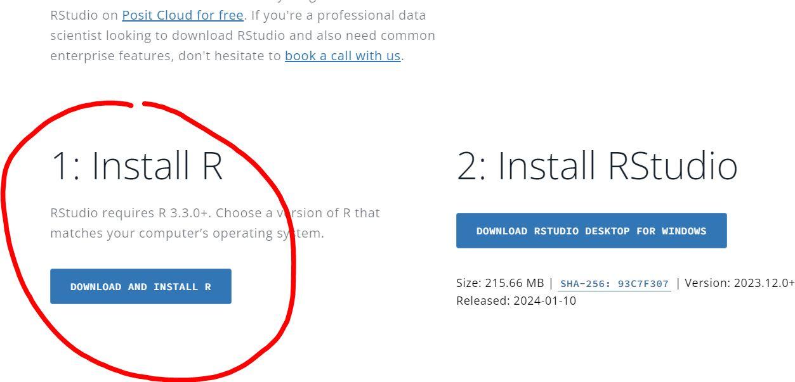
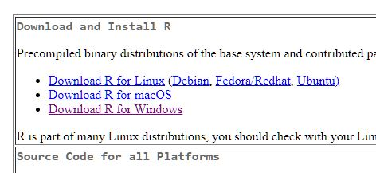
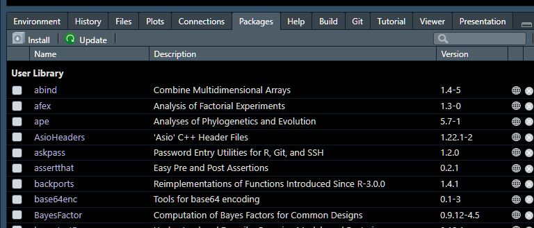
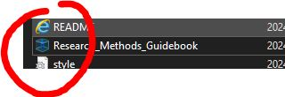

--- 
title: "PSYCH 2126: Research Methods"
author: "S.Heron"
date: "`r Sys.Date()`"
site: bookdown::bookdown_site
documentclass: html
bibliography: [book.bib, packages.bib]
# url: your book url like https://bookdown.org/yihui/bookdown
# cover-image: path to the social sharing image like images/cover.jpg
description: |
  Writing reproducible research.
link-citations: yes
github-repo: rstudio/bookdown-demo
---

# Introduction

This guidebook will walk you through all of the steps necessary to complete your term assignment. The steps involve:

Phase 1:

1. Downloading and installing R Statistical Software

2. Downloading and installing R Studio for your specific platform (Windows or Mac)

3. Customizing R and getting comfy with the basics

Phase 2:

1. Design your study

2. Generate your data

3. Visualize your data

4. Test your results

5. Write up your results

6. Knit your R document into a lovely APA formatted pdf for handing in (don't worry, you'll learn how to do this part!)

## Why R? 

A key goal of any psychology researcher is to not only design and execute reproducible experiments, but to *communicate* those results to other people. Today, researchers are moving away from using multiple pieces of software to conduct and communicate their research. Each step that a researcher takes from importing their data to Excel, moving it to SPSS for analyses and then copy-pasting tables and visualizations into Word, is a step that must be remembered and done all over again when re-doing the analysis. As you can imagine, it is very easy to forget a step, not to mention disguise data funny business along the way.

```{r, echo=FALSE, out.width="100%"}
knitr::include_graphics("images/WhyR.jpg")
```

With R, Rather than having to use multiple pieces of software you use one piece of FREE software. With one project which includes a record of everything you've done. This means if you or another researcher wants to rerun the analysis with new data, its a simple matter of putting the data in a project folder and voila, rerun the same code. When you're ready to publish? Your entire manuscript can be written in R along with your analysis and eventually publish the data--everything is there to easily and exactly replicate every step of the process.

This quick guide is meant as a companion to your assignment. It is not meant to teach you all the ins and outs of R, as that would be several courses on its own, instead, you will get a small taste of R and its capabilities in hopes that it might ignite the spark of curiosity to learn more. As, the other great thing about R is there is a WEALTH of free resources available on the internet where you can find the answer to any analysis question. I will share lots of handy resources in the Resource section. R is where it's at.

```{r include=FALSE}
# automatically create a bib database for R packages
knitr::write_bib(c(
  .packages(), 'bookdown', 'knitr', 'rmarkdown'
), 'packages.bib')
```

<!--chapter:end:index.Rmd-->

# The Assignment {#cross}

```{r, echo=FALSE, out.width="100%"}
knitr::include_graphics("images/Kahneman&Tversky.png")
```

Amos Tversky (left) and Daniel Kahneman (right) wrote some articles that challenged well-established theories in Psychology that have had an impact well beyond the discipline of psychology (e.g. economics).

**Assignment outline**

The assignment consists of two parts.

## Part I {#Part1}

Find one of K&T's original research papers by using Google Scholar or the [Laurentian Omni library](https://omni.laurentian.ca/discovery/search?vid=01OCUL_LU:OMNI&lang=en "Laurentian Library"). Next, find 9 more studies that each build on the study before. So, your first study will be a Kahneman and Tversky study, next, a study that sits on the shoulders of that study, then another that progressed from that study, and so on until you find a study conducted between 2020 and today. A minimum of 10 articles should be cited. As Dr. Emond says, "Kind of like six degrees of separation but with citations".

```{r, echo=FALSE, out.width="100%", fig.align="center"}
#knitr::include_graphics("images/kevinback.jfif")
```

## Part II {#Part2}

Next, you will choose ONE of T&K's theories and design an **experiment** to test it. 

Your final submission will include:

1.  A brief introduction to the topic, explaining the theory you are exploring and referencing the article(s) it is based on. You will place this in the intro section of the R Markdown document.
2.  State your hypothesis and any other questions you would like to answer *clearly*.
3.  Operationally define your independent variable(s) and dependent variable(s). Keep in mind you should choose a design that demonstrates your understanding of the concepts learned in class. A factorial design will blow our socks off.
4.  Describe your design and procedure clearly in the Methods section.
5.  Do not forget to explain how you will control for any confounding variables.
6.  Create some data you might expect your design would produce. You might be thinking whhaaat? Don't worry, I will help with this part! No need to worry about it yet, first do your research, write up your intro and methods and THEN we'll create the data.
7.  Once you have your data, you will dig into analyses with R. When here, you will follow a tutorial that will teach you how to visualize your data and conduct your analysis (ANOVA, correlations or anything else your heart desires).
8.  You will create a data visualization that conveys your main results.
9.  You will BRIEFLY summarise your findings in a mini Results section.
10. Finally, you will write a very brief conclusion wrapping it all up and including at least two sentences that include two things you learned or didn't learn during this assignment!

For all of the parts above, **complete** descriptions must be given. In **full detail**. Also, you must **justify** all of your choices. Why you decided to design it the way you did and define your variables the way you did.

## Keep in Mind

This assignment is meant to give you a taste of producing reproducible research with R. You will learn to conduct your analyses *and* write up in R so at the end you have lovely little document that includes everything a person would need to reproduce your experiment. You will hand in a pdf copy of your report, which will include your data. Don't worry about HOW we'll do this yet, just know that you will.

Now, after you've found your studies and chosen your theory, there are a couple of ways you can tackle this:

  1. **Do your write up in Word first**, then copy and paste it into R when you're ready. 

  2. **Do what I do, write directly in R**. 
  
HOWEVER, because R can be intimidating and confusing at first and I don't want you losing hours of work with a mistake, it might be smart to have a copy of your write up in Word or Google Docs, just in case! Once you get the knack of R you'll never have to use Word as back up again. But for now, it might give you peace of mind and its very easy to copy and paste your write up directly into R. It's what I did in the beginning and it worked like a charm.

```{r, echo=FALSE, out.width="50%", fig.align="center"}
knitr::include_graphics("images/smart-brain.gif")
```

Remember: if you have ANY trouble with this assignment, don't hesitate to reach out sheron\@laurentian.ca . We could always set up a zoom meeting or I could meet you at Laurentian to help trouble shoot any issues. I'm here to help and in fact LOVE helping students--just don't wait until the last minute. K thanks :)

You can now head to the Getting Started with R section! Congrats!

Tutorial for Part II

Next you will download the MY_ASSIGNMENT template I created for you and copy it to the root directory of your project folder. Once copied to your project folder, from the R Studio workspace, go the file pane and select the file you just placed there. This should open the R Markdown document in your workspace. I created this document to work like a template. You can simply replace my prompts and text with your own. 

R Markdown

Let's get acquainted with your first R Markdown document. The first thing you might want to do is rename it (right-click on the tab and click rename). Try knitting the document next. Click on the Knit icon above and wait. You should see some code running by in the render window to the right. Hang tight, and if all goes well it should complete and you'll find a pdf file with the same name in the folder of your project.

Play Around

You'll notice that there are areas with plain text, and small codechunks. Any text in a codechunk with a hashtag in front will NOT be printed in the pdf document. Only the outputs of any functions you run from here. WARNING: you can't have plain text in any chunk UNLESS it has a hashtag in front of it which basically tells R to ignore it. The chunks are meant to execute R code so only code should be here unless preceeded by the hashtag. Another important note: R IS CASE SENSITIVE. So, if you are copying my code or any code, you must copy the exact text including case. If something is called "df" you **must** call it with df, not Df or DF as R won't find it.

**If you leave random text in these chunks, it will throw an error, and the document won't knit.**

If you try to knit the document and there's a problem, you will see an error in the render window to the right. Sometimes, it will give a clue as to where the problem is; for example, it could say that it stopped rendering around line 120. Use the line numbers to the left to find the offensive mistake! Basically, if knit fails, it is almost always because there is a problem with something you typed in a code chunk.

The following code outputs a histogram of the variable speed from the cars dataframe.

```{r}
hist(cars$speed)
```

Try copy and pasting it into a chunk in your document. I've included one for you near the top that says \### ADD SOME CODE TO ME ###. Now, run this code chunk by clicking the little green play arrow at the top of the chunk. If it worked, you should see a little histogram below the chunk.


Now try knitting the document (Knit at top of the frame), and you should find the histogram in the pdf.

Create your own R Markdown document

Here you will find the requirements for your assignment. First, let's create an R Markdown document so you can get started. Begin by heading to the File dropdown (top left), selecting New File and R Markdown and you'll see the following popup:

{width="533"}

On the left you're going to select "From Template" and then "APA-style manucript (6th edition)"


Now you should see an untitled document in the main pane of Rstudio. Click on the little disk icon at top left to save this file and give it a name while you're at it. It will automatically save the file to your project folder.

<!--chapter:end:01-Assignment.Rmd-->

# Getting started with R {#Intro}

## Installing R and R Studio

Head to this link:

[R and R Studio](https://posit.co/download/rstudio-desktop/)

You will first click "Install R".

[{width="698"}](https://cran.rstudio.com/)

From the next page, you will choose one of the top links–either R for Windows or R for macOS, depending on your laptop.

[{width="419"}](https://cran.rstudio.com/)

Download the file, then install using the default settings if possible. If you run into problems there is plenty of help to be found on the R website and there is a great video below that can help too.

Once R is installed, click the link above again, and this time go to step 2: Install R Studio. Click the link circled below for a Windows install,

[](https://posit.co/download/rstudio-desktop/)

For a Mac install scroll down a little on the same page and you'll see the Mac OS 12+ install:

[](https://posit.co/download/rstudio-desktop/)

## Opening R Studio 

1.  Open R Studio by clicking on it it's icon and once you have your first package, you will open via the cube icon in your project folder (see below).

{width="218"}

NOTE: you will almost *never* open R itself, but always R studio.

## Customizing R Studio

RStudio is divided into 4 “panes”. Default colour is white with the following layout:

-   The **Source** for your scripts and documents (top-left, in the default layout)

-   Your **Environment/History** (top-right) which shows all the objects in your working space (Environment) and your command history (History)

-   Your **Files/Plots/Packages/Help/Viewer** (bottom-right)

-   The R **Console** (bottom-left)

The placement of these panes and their content can be customized (see menu, Tools -\> Global Options -\> Pane Layout). For ease of use, settings such as background color, font color, font size, and zoom level can also be adjusted in this menu (Global Options -\> Appearance).

I prefer the "modern" R studio theme (Tools –\> Global Options –\> Appearance). And my console top-right along with terminal and background jobs and Environment, History, Files, Plots, Packages etc. bottom right.


One of the advantages of using RStudio is that all the information you need to write code is available in a single window. There are also shortcuts, autocompletion, and highlighting for the major file types and object you will use in RStudio.

Customize R by checking this [Video Tutorial](https://www.youtube.com/watch?v=jAHJyeOqe24) out by the amazing Psychology researcher and statistics prof Andy Field. I highly recommend ALL of his stats videos as well as his textbooks–especially the ones relating to R. Here, he will walk you through customizing your workspace.

Text [Tutorial](https://support.posit.co/hc/en-us/articles/200549016-Customizing-the-RStudio-IDE "How to customize R Studio")

## Install Packages

On its own, R is great but

In the console window of R, copy and paste this code into the command line then hit return:

```{r, eval=FALSE}
install.packages(c("tidyverse", "dplyr", "psych", "patchwork", "sjPlot", "lme4", "papaja"))
```


You'll see a bunch of code flashing by while the packages install. Hopefully it goes smoothly :) Sometimes you will have to restart R after an install, but an easy way to do this is to click on the "Session" drop-down above and then select "Restart R." This will restart the program without actually leaving the workspace.

To install an individual package, you would type:

```{r, eval=FALSE}

install.packages("thenameofthepackagehere")

```

or you can search for the package in the Cran package directory found in the packages tab



When the installations have finished, you can load the packages into the workspace by pasting the following code in the console:

```{r, eval=FALSE}
library(dplyr)
library(tidyverse)
library(lme4)
library(psych)
library(patchwork)
library(sjPlot)
library(papaja)

```

but we'll get back to packages when creating your first project.

## Creating your project

At the top left of your screen, click the File dropdown and select "New Project". By default, R projects are usually stored in your documents folder. Here, you'll click on **New Directory**.


Next, click New Project and you'll be prompted to select a location for your project. I find it best to leave the project subdirectory as C:/documents (or wherever your docs directory is). Then select a name for your new project. E.g. ResearchMethods_Assignment. This is where your project, your data and all of your files will live.


In future, you should open Rstudio and your project from that folder where you'll see an icon that looks like a 3-d cube.



This opens your project workspace. A workspace is your current working environment in R which includes any user-defined object. By default, all of these objects will be saved, and automatically loaded, when you reopen your project.

Next, it is good practice to create several subfolders for the data you will analyze. Click on the "Files" tab in the right pane (depending on where you located it). Here you should see the root folder of your project. From here, click "New Folder" and name in "Raw Data" and then create another called "Processed Data" and now you're set. All files related to your project will be in this workspace.

## How to learn more?

The material we will cover in this short assignment will only give you a taste of what R is capable of. For advanced operations like cleaning your dataset, running more complex models or creating beautiful visualizations you will need to learn more.

The best way to become more proficient with R, like any tool, is to actively use it to answer your research questions. I learned R from the internet out of frustration with the limitations of SPSS. There was lots of trial and error, but over time I got better and better, and had to look up code less and less.


At first it may feel daunting, but you will quickly see that there are amazing resources online. FOr example, maybe you want make your wide dataset long for some multilevel analyses–how do you do this in R? Well, a simple "how to make wide dataset long in R" will conjur up thousands of useful links where you can simply copy and paste their code and then just adjust it to use with your specific data. "How do I run an ANOVA in R?" or "ANOVA tutorial in R" will find you:

<https://statsandr.com/blog/anova-in-r/>

The great thing about these kinds of tutorials is that they include the code and often the rationalization as to why they are conducting the analyses like they are with recommendations of what steps should come first as well as how you would test any assumptions. You will learn SOOO much not just about R, but about data this way.


 R Markdown

R Markdown Cheatsheet.

<https://www.rstudio.com/wp-content/uploads/2015/02/rmarkdown-cheatsheet.pdf>

<!--chapter:end:02-InstallRandRstudio.Rmd-->

# Research Assignment

You can add parts to organize one or more book chapters together. Parts can be inserted at the top of an .Rmd file, before the first-level chapter heading in that same file. 

Add a numbered part: `# (PART) Act one {-}` (followed by `# A chapter`)

Add an unnumbered part: `# (PART\*) Act one {-}` (followed by `# A chapter`)

Add an appendix as a special kind of un-numbered part: `# (APPENDIX) Other stuff {-}` (followed by `# A chapter`). Chapters in an appendix are prepended with letters instead of numbers.


<!--chapter:end:03-AnalyseswithR.Rmd-->

# Troubleshooting

## Footnotes

Footnotes are put inside the square brackets after a caret `^[]`. Like this one ^[This is a footnote.]. 

## Citations

Reference items in your bibliography file(s) using `@key`.

For example, we are using the **bookdown** package [@R-bookdown] (check out the last code chunk in index.Rmd to see how this citation key was added) in this sample book, which was built on top of R Markdown and **knitr** [@xie2015] (this citation was added manually in an external file book.bib). 
Note that the `.bib` files need to be listed in the index.Rmd with the YAML `bibliography` key.


The RStudio Visual Markdown Editor can also make it easier to insert citations: <https://rstudio.github.io/visual-markdown-editing/#/citations>

<!--chapter:end:04-citations.Rmd-->

# Handy Resources

## Useful Links

Here is an equation.

\begin{equation} 
  f\left(k\right) = \binom{n}{k} p^k\left(1-p\right)^{n-k}
  (\#eq:binom)
\end{equation} 

You may refer to using `\@ref(eq:binom)`, like see Equation \@ref(eq:binom).


## Other tips and tricks

Labeled theorems can be referenced in text using `\@ref(thm:tri)`, for example, check out this smart theorem \@ref(thm:tri).

::: {.theorem #tri}
For a right triangle, if $c$ denotes the *length* of the hypotenuse
and $a$ and $b$ denote the lengths of the **other** two sides, we have
$$a^2 + b^2 = c^2$$
:::

Read more here <https://bookdown.org/yihui/bookdown/markdown-extensions-by-bookdown.html>.

## Callout blocks


The R Markdown Cookbook provides more help on how to use custom blocks to design your own callouts: https://bookdown.org/yihui/rmarkdown-cookbook/custom-blocks.html

<!--chapter:end:05-blocks.Rmd-->

`r if (knitr::is_html_output()) '
# References {-}
'`

<!--chapter:end:07-references.Rmd-->

