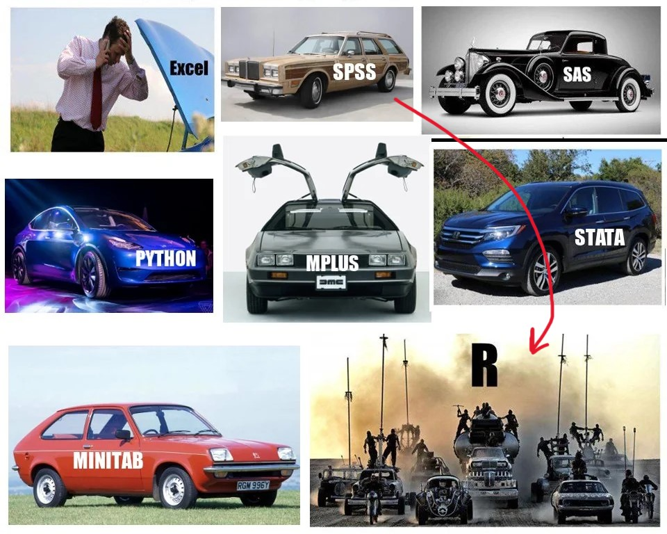

# Introduction

This guidebook will walk you through all of the steps necessary to complete your term assignment. Get ready, because you are embarking on a journey... from the safe GUI point-and-click world of SPSS to the code-based Thunderdome of R.

**Where we're going...**

```{r, echo=FALSE, out.width="100%", fig.align="center"}

```

## Goals

The goal of the assignment is twofold: First, to give you the opportunity to flex what you are learning in class, and two, to introduce you R Statistical Software; a game-changer in any future research endeavors.

**This guide is meant as a companion to your assignment.** It is not meant to be an in depth course on R, as that would be several entire courses on its own, but by the end you *will* have had a small taste of R and its capabilities. And who knows, it might ignite a spark of curiosity that jump starts a desire to learn more.

**By the end of this assignment**, you will have read a bunch of interesting research papers, designed a mini study based on a theory of your choice and completed some analyses and a full write up in R that you will hand in. Your paper will include everything a person would need to reproduce your experiment from start to finish. Don’t worry about HOW we’ll do this yet, **just know that you will**.

## What can R do?

Disclaimer: I do NOT work for R. I just love it.

-   Advanced statistical analyses without paying for packages (it's open source!)
-   The best [data visualization](https://r-graph-gallery.com/) capabilities of ANY statistical software
-   Reproducible research is made easy, an integral partner of [Open Science research](https://www.apa.org/monitor/2021/11/career-open-science)
-   Thousands of [free online resources](https://bookdown.org/mikemahoney218/IDEAR/introduction-to-r.html) to learn anything you don't know
-   Did I say its open source.. ?
-   Make gorgeous [publication-ready papers](https://rmarkdown.rstudio.com/gallery.html) and books with inline analyses
-   Make gorgeous slideshows with analyses and text all in one document
-   Make gorgeous websites (This website you're reading is made 100% in R)
-   Juice up your resume (researchers with R skills are a HUGE asset and hard to come by)
-   Help you understand data better because the analysis isn't happening behind a graphic user interface
-   Ramp up your street cred 1000%.

```{r, echo=FALSE, out.width="95%", fig.align='center'}
knitr::include_graphics("images/WhyR2.jpg")
```

```{r include=FALSE}
# automatically create a bib database for R packages
knitr::write_bib(c(
  .packages(), 'bookdown', 'knitr', 'rmarkdown'
), 'packages.bib')
```
