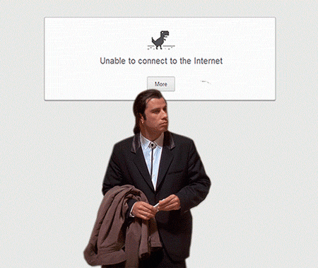
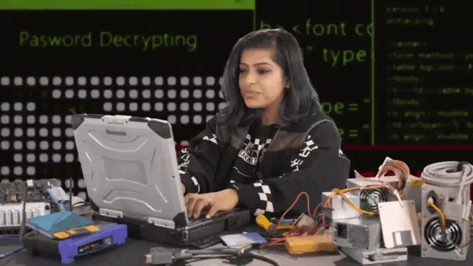

# Update: March 2, 2024



Hi class, due to the unfortunate, ongoing internet/email/D2l disruption at Laurentian, we may have to change things up a bit. As of this morning I still don't have access to my LU email--though I tried changing my password it didn't seem to work.

If you have your design ready (or have questions) and would like your data, please email me your design at the address below. I will need your IVs, DV, sample size, as well as your units of measure. For example, your measure might be 10 questions, each with a 5-point Likert response option or maybe your DV is a count of how many times a participant laughs. These are the things I'd need to know. Other than that, no formatting or citations are needed. Just enough information that I know what your data would look like.

[shaunapsych\@gmail.com](mailto:shaunapsych@gmail.com){.email}

I was hoping to create your data sets this weekend and then host a lab where I could walk you through the next steps in R (in person), but until we have a better idea of what is happening with WiFi and internet access at the school, we have to sit tight. Hopefully, we'll know more this week. Keep an eye out here for more info.

In the meantime, continue working on your assignment in Word. The writeup is the most time consuming part, so get that taken care of (intro, methods, etc.) first. That way the only step left is the analysis and a quick write-up of your results. Once you've sent your design to me, get R installed and try some of the tutorials. For those who feel comfortable foraying into R, feel free to complete the analysis and next steps yourself (once you get some data from me), and email if you run into trouble.

Regardless, I will hold a lab preferrably in person but potentially over Zoom sometime in the next couple of weeks. Stay tuned for more details.

Until then, don't stress out! We got this.

Shauna

{width="524"}

# Introduction

This guidebook will walk you through all of the steps necessary to complete your term assignment. Get ready, because you are embarking on a journey... from the safe GUI point-and-click world of SPSS to the code-based Thunderdome of R.

**Where we're going...**

```{r, echo=FALSE, out.width="100%", fig.align="center"}
knitr::include_graphics("images/WhyR.jpg")
```

## Goals

The goal of the assignment is twofold: First, to give you the opportunity to flex what you are learning in class, and two, to introduce you R Statistical Software; a game-changer in any future research endeavors.

**This guide is meant as a companion to your assignment.** It is not meant to be an in depth course on R, as that would be several entire courses on its own, but by the end you *will* have had a small taste of R and its capabilities. And who knows, it might ignite a spark of curiosity that jump starts a desire to learn more.

**By the end of this assignment**, you will have read a bunch of interesting research papers, designed a mini study based on a theory of your choice and completed some analyses and a full write up in R that you will hand in. Your paper will include everything a person would need to reproduce your experiment from start to finish. Don’t worry about HOW we’ll do this yet, **just know that you will**.

## What can R do?

Disclaimer: I do NOT work for R. I just love it.

-   Advanced statistical analyses without paying for packages (it's open source!)
-   The best [data visualization](https://r-graph-gallery.com/) capabilities of ANY statistical software
-   Reproducible research is made easy, an integral partner of [Open Science research](https://www.apa.org/monitor/2021/11/career-open-science)
-   Thousands of [free online resources](https://bookdown.org/mikemahoney218/IDEAR/introduction-to-r.html) to learn anything you don't know
-   Did I say its open source.. ?
-   Make gorgeous [publication-ready papers](https://rmarkdown.rstudio.com/gallery.html) and books with inline analyses
-   Make gorgeous slideshows with analyses and text all in one document
-   Make gorgeous websites (This website you're reading is made 100% in R)
-   Juice up your resume (researchers with R skills are a HUGE asset and hard to come by)
-   Help you understand data better because the analysis isn't happening behind a graphic user interface
-   Ramp up your street cred 1000%.

```{r, echo=FALSE, out.width="95%", fig.align='center'}
knitr::include_graphics("images/WhyR2.jpg")
```

```{r include=FALSE}
# automatically create a bib database for R packages
knitr::write_bib(c(
  .packages(), 'bookdown', 'knitr', 'rmarkdown'
), 'packages.bib')
```
